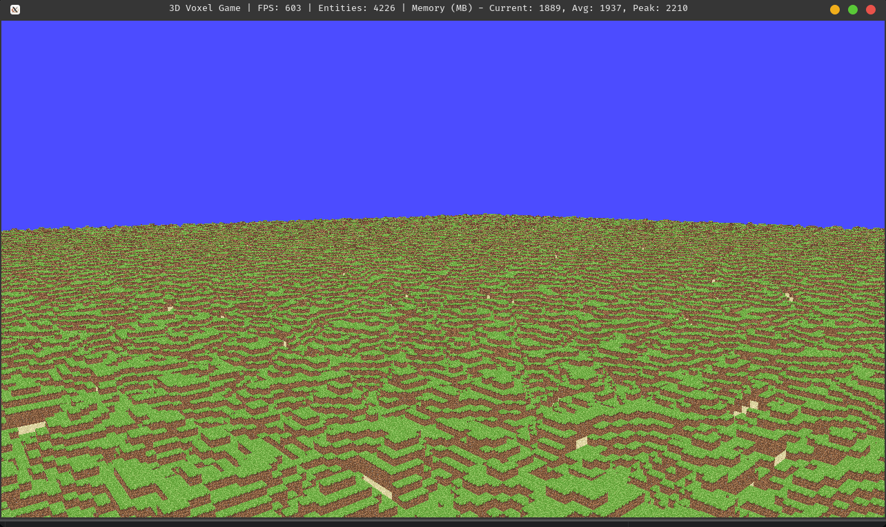

# 3D Block Game

A voxel-based game engine written in C# using OpenTK and Entity Component System architecture.

See [Documentation](index.md) for more information.

## Features

- Procedural chunk generation
- Entity Component System (ECS) architecture
- OpenGL-based rendering pipeline
- Dynamic chunk loading/unloading
- Texture support
- Basic physics and collision detection

## Prerequisites

- .NET SDK (10 or later)
- OpenGL-compatible graphics card

## Getting Started

1. Clone the repository
2. Run `make build` to build the solution
3. Run `make` to build and start the game

For detailed information about build commands and troubleshooting, see [Build Documentation](Docs/build-script.md).

## Project Structure

- `VoxelGame/` - Main game engine and implementation
  - `EntityComponentSystem/` - ECS implementation
  - `GraphicsPipeline/` - OpenGL rendering pipeline
  - `World/` - World generation and chunk management
- `Tests/` - Unit tests
- `Docs/` - Documentation

## Architecture

The game uses an Entity Component System (ECS) architecture with the following key systems:

- `WorldSystem` - Manages chunks and world generation
- `ChunkGenerationSystem` - Handles procedural chunk generation
- `RenderSystem` - Manages OpenGL rendering pipeline
- `InputSystem` - Handles user input
